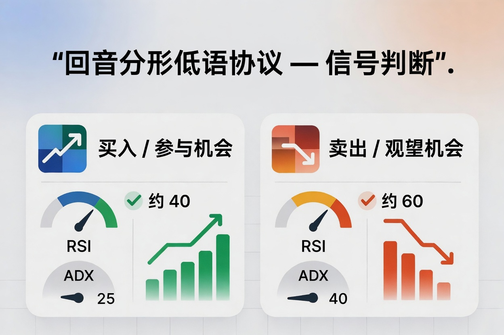
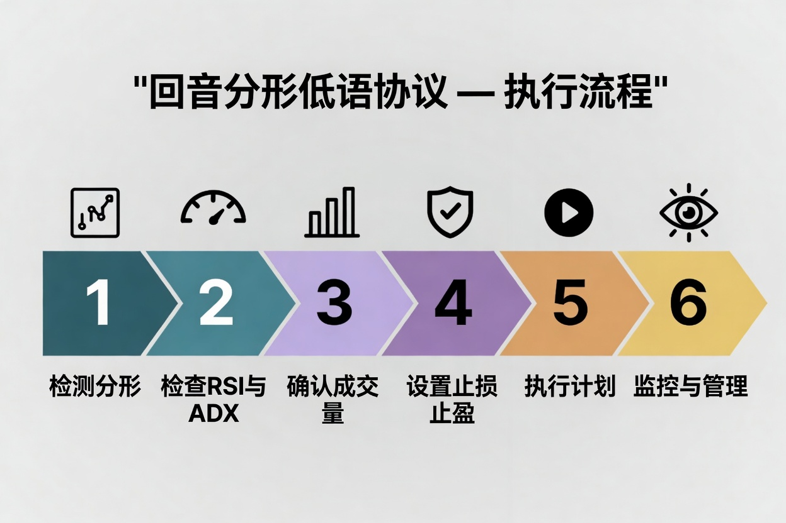
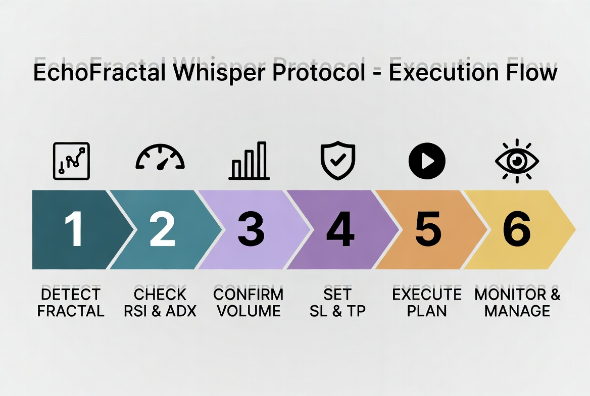
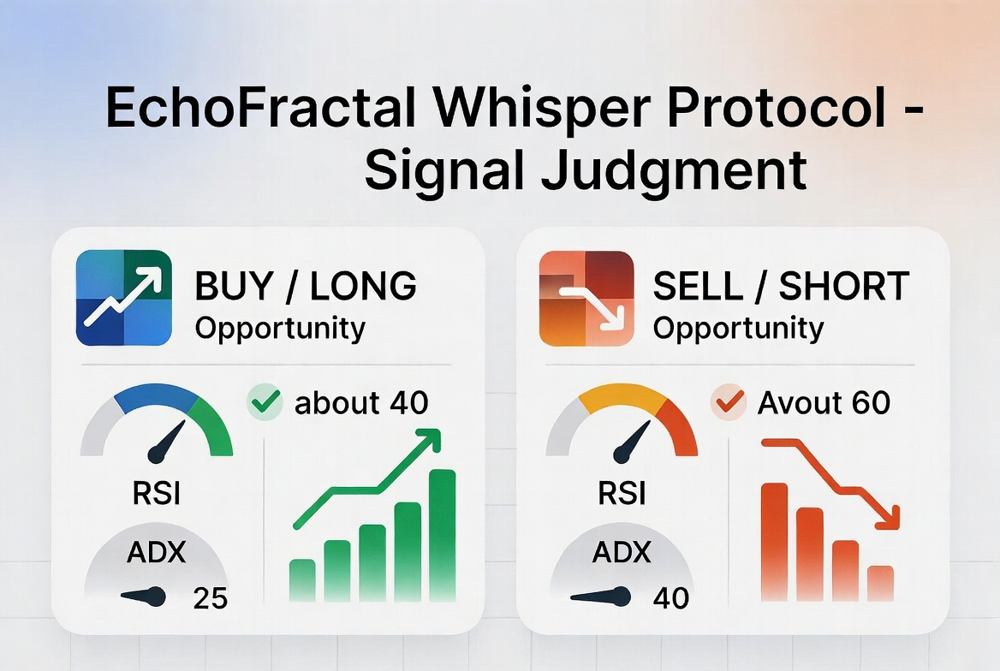

# Echofractal Whisper

> Symbol `Multi` · Timeframe `Multi` · Magic `1000020`

  

## Overview
Echofractal Whisper is a complete quantitative trading strategy running on `Multi` `Multi`. It enters on price-structure breakouts confirmed by momentum/volume and a trend filter, with ATR-based dynamic stops and fixed-percentage risk sizing — balancing trend-following with strict risk control. Ready to run on MT4/MT5.

*中文：本策略运行于 `Multi` `Multi`，通过价格结构突破 + 动量/量能确认 + 趋势过滤入场，ATR 动态止损止盈，固定风险百分比仓位管理。*

## Core Logic
- Structure breakout + momentum/volume confirmation + trend alignment → entry
- Uniquely identified by magic number `1000020` per account (no interference)
- Evaluated only on a new bar; daily entries capped by `MaxDailyTrades`

*中文：结构突破 + 动量/量能确认 + 趋势一致才入场；以魔术号 `1000020` 唯一标识；仅在新K线判断，单日次数受 `MaxDailyTrades` 限制。*

## Parameters | 参数
| Parameter | Default |
|-----------|---------|
| `FractalPeriod` | 5 |
| `VolumeSMAPeriod` | 20 |
| `VolumeMultiplier` | 1.8 |
| `ATRPeriod` | 14 |
| `ATRSLMultiplier` | 1.5 |
| `ATRTPMultiplier` | 3.0 |
| `TrendMAPeriod` | 200 |
| `RiskPercent` | 1.0 |
| `MaxDailyTrades` | 3 |

## Execution Flow
1. Wait for a new bar close to trigger evaluation
2. Verify structure / momentum / trend conditions are all met
3. If met, size the order by `RiskPercent` and attach ATR stop/target
4. Positions close via stop/target or a reverse signal

*中文：① 等新K线收盘 ② 校验结构/动量/趋势三要素 ③ 满足则按 `RiskPercent` 计算手数并挂 ATR 止损止盈 ④ 由止损止盈或反向信号了结。*

## Risk Management
- Stop = ATR × `ATRSLMultiplier`, Target = ATR × `ATRTPMultiplier`
- Lot size computed dynamically from account `RiskPercent`
- Trading-day boundary follows the broker server time

## Live Data
- Performance dashboard: <https://jybj.org/strategy-dashboard/>
- Online strategy page: <https://git-wp-project.github.io/strat-EchoFractal_Whisper-1000020/>
- 中文文档 / Chinese doc: <https://git-wp-project.github.io/strat-EchoFractal_Whisper-1000020/zh.html>

## Source & Download
The `ea/` directory contains MT4/MT5 source and compiled files.

---
*Risk Warning: Simulated/historical data, past performance is not indicative of future results and does not constitute investment advice. 风险提示：模拟/历史数据，过往不代表未来，不构成投资建议。*
